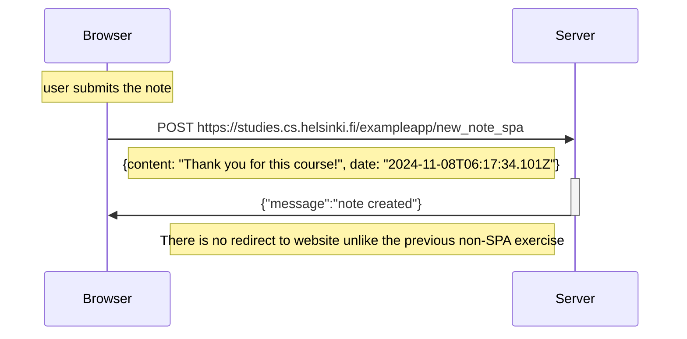

```mermaid
sequenceDiagram
    participant Browser
    participant Server

    Note over Browser: user submits the note

    Browser->>Server: POST https://studies.cs.helsinki.fi/exampleapp/new_note_spa

    Note right of Browser: {content: "Thank you for this course!", date: "2024-11-08T06:17:34.101Z"}

    activate Server
    Server->>Browser: {"message":"note created"}
    deactivate Server
    Note left of Server: There is no redirect to website unlike the previous non-SPA exercise
```
